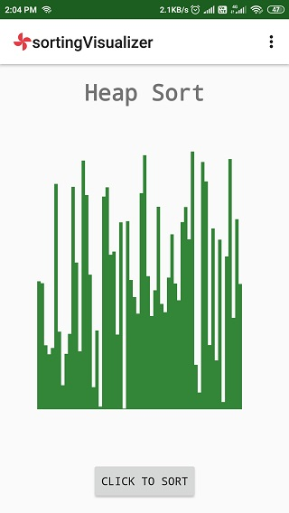
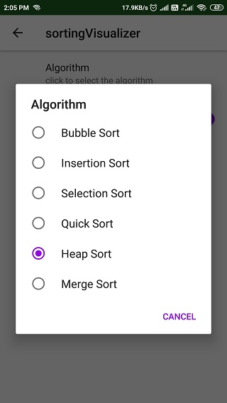

# sortingVisualizer
Visualize Bubble Sort,Insertion Sort,SelectionSort,Quick Sort,Merge Sort and Heap Sort

## Main screen

The main screen shows different arrays as shown in the list screen on touching the screen(click again to generate a different array) and it can be sorted using the sort button.

## List screen

## Sorted list

A delay is added in to the sorting algorithm to show the animation.
 the sorted list is in violet color to indicate that the sorting is complete. 

## Settings page

the settings page allows the user to change the speed,array size and the sorting algorithm 
(among the six mentioned previously).

## Change algorithm

The screen to change algorithm.
